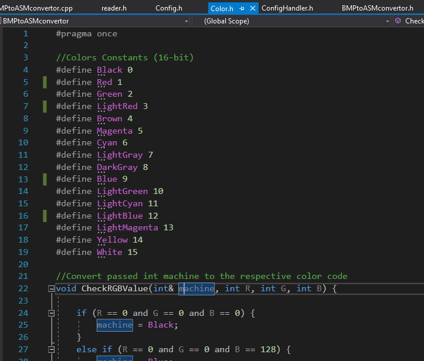

# antiPixel  

👾 Convert BMPs and text files to proper x8086 assembly arrays.

## About
Converts pictures and text files into MASM code arrays.
Basic image reading and manipulation in C++, in Visual Studio 2019. 
*Author: Saad Bazaz.*
> Use **cactus_example.txt**, **16color-palette** or **cactus_example.bmp** as examples

## Instructions
### HOW TO USE METHOD 1:
1. Create a pixel drawing in mspaint on 25x25 canvas
2. Save As => BMP Picture => (24-bit Bitmap)
3. Go to https://www.text-image.com/convert/ascii.html, convert the BMP to text
4. Save the text in a txt file, place it in the program's solution folder
5. Compile the program and feed it the text file

### HOW TO USE METHOD 2 (my current method):
1. Create a pixel drawing in mspaint on 25x25 canvas
2. Save As => BMP Picture => (16 color Bitmap)          !!!!! IMPORTANT !!!!!
3. Now, Save As => BMP Picture => (24-bit Bitmap)       !!!!! These steps were necessary to convert all extra colors into 16 color !!!!!
3. NOW you can place the image in the program's solution folder
4. Compile the program and feed it the bmp file

### HOW TO USE METHOD 3:
1. Create a pixel drawing in mspaint on 25x25 canvas
2. Save As => BMP Picture => (24-bit Bitmap)
3. Place the image in the program's solution folder
4. Compile the program and feed it the bmp file

You can change the color number assignments according to your desire. Just head over to Color.h and change the preprocessor definitions.
👇

## Troubleshooting
- if you can't find the User_Results folder, make it yourself or download the latest build
a) STRUCTURE
User_Results =>
-     BMPColorASM
-     BMPMonoASM
-     TextToASM
  
- Sometimes the arrays may be terminated by an extra comma so remove that before running the arrays.
- avoid using pictures bigger than 500x500 pixels. It won't crash in any situation, but it would be slow to render and you'd probably get worried.
- The program has not been tested with images generated from different programs, like GIMP or Photoshop. In those cases, 
you would have to look up the HEADER SIZE and change it in the Advanced Configurations

## Support
Make pull requests, create Issues, and do everything you want to get information out of me.
You can personally email me at saadbazaz@hotmail.com
I'd love to entertain any questions and suggestions!
